# Lineage

**A family's own research platform: collect what the family has, check it against the records,
and keep it as a sourced, browsable record that outlives everyone in it.**

[](https://github.com/rexsaurus/Lineage/actions)
[](LICENSE)

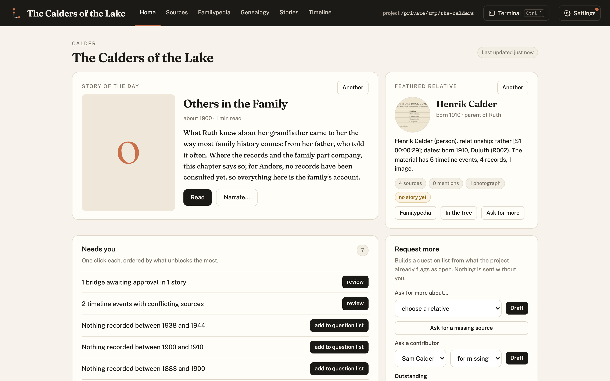

*Home, for an invented family (the Calders). The story of the day, a relative to fill in,
and "Needs you": the open bridge, the two places where the sources disagree, and the gaps in
the timeline, each one click from being dealt with.*

---

Family history lives in a dozen places at once: a grandmother's memory, an aunt's shoebox of
letters, a cousin's photographs, a museum catalogue, a ship's manifest nobody has looked at
in a century. Lineage brings it into one record and keeps it honest.

- **Family members contribute from wherever they are.** Recordings, photographs, documents,
  letters, scans, links. Each one is ingested, summarized, tagged to the people and subjects
  in it, and indexed. Nothing is renamed or altered on disk.
- **Public records come in beside the family's version.** Archives, censuses, rosters, ship
  registers and newspapers are searched, catalogued by type, and snapshotted locally so the
  record survives the link. Where a record and the family disagree, Lineage says so and keeps
  both. It doesn't choose.
- **The result is a living record**: a genealogy built from evidence, a timeline, and a
  Familypedia with an article for every person, place, event, vessel, organization and object
  the material names. Every fact in it clicks back to the passage or record that supports it.
- **Stories, a printed book and narration are exports of that record.** They come at the end,
  and they inherit its sourcing. They are not the point.

### What makes it different

| | |
|---|---|
| **Cooperative** | Many contributors, one shared record. Everyone adds what they have; the editor reviews it before it counts. |
| **Researched** | Archives and public records, catalogued by type (passenger list, census, ledger, newspaper), with archive, number, link and retrieval date, and a local snapshot. |
| **Honest** | Every fact carries its tier: *witnessed*, *told*, *family lore* or *what the records show*. Contradictions are kept and shown. Generated images are always marked as illustrations. Nothing is invented; anything a writer would like to add is held as a *bridge* until a person approves it. |
| **Durable** | Plain files in a git repo you own: CSV, Markdown, JSON, the original scans. The record outlives the links, the apps and the people in it. |

---

## A tour of the dashboard

Every picture below is the real dashboard, captured by `make screenshots` against
[the demo lineage](examples/demo-lineage/): an invented family, invented recordings (spoken
by the computer) and invented records on `example.org`. No real family appears.

### Sources: everything the family has, in one place

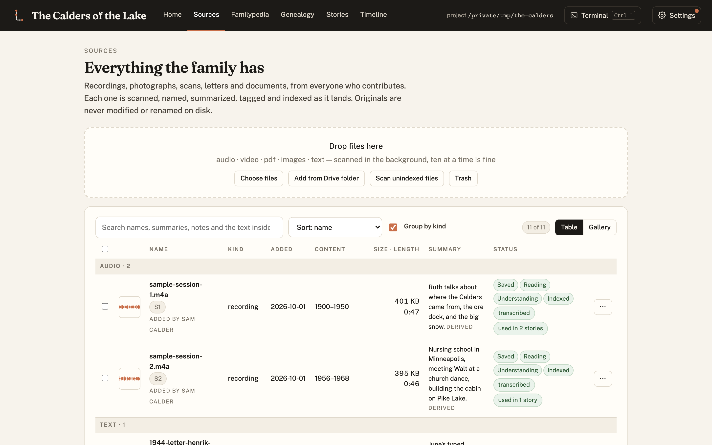

Recordings, scans, letters and documents, each scanned, named, summarized and indexed as it
lands, with who added it and when. Recordings get transcripts with speaker labels and
timestamps, so every sentence later can point back at the tape.

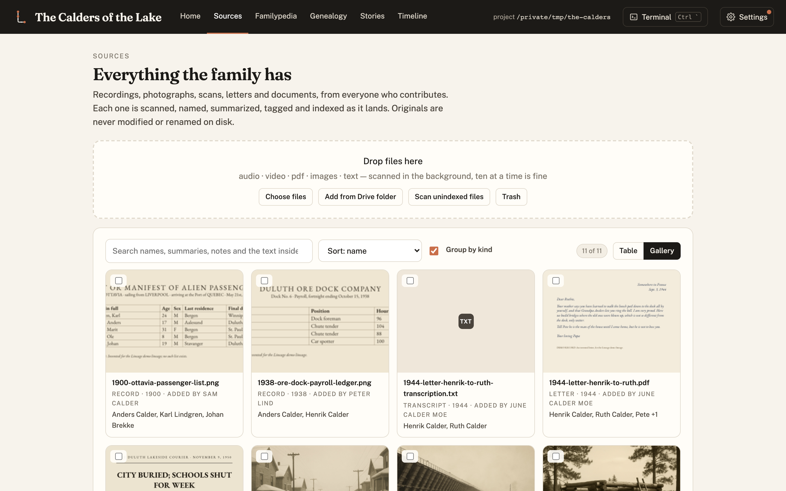

The same sources as a gallery: scans, letters and photographs at a glance, with who added
each one. Select several and tag them all to a person, a place or a ship at once.

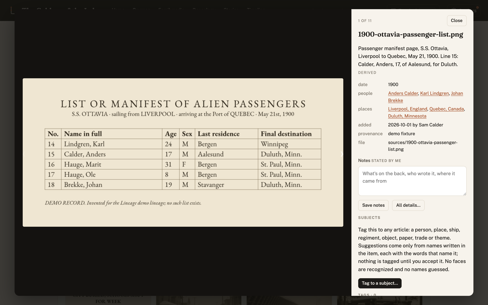

Click one to see it full size, step through the rest with the arrow keys, and read or edit
its summary, people, places, provenance and notes beside it.

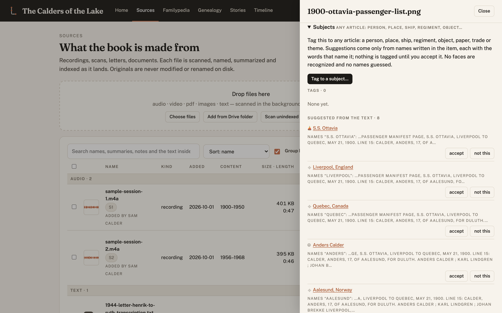

Open a source and everything about it is editable, and everything derived is marked as
derived. **Subjects** tags it to any article (a person, a place, a ship, a regiment, an
object). Suggestions come only from names written in the item, with the words that name them,
and nothing is tagged until someone accepts it. No faces are recognized and no names guessed.

### Familypedia: an article for everything the material names

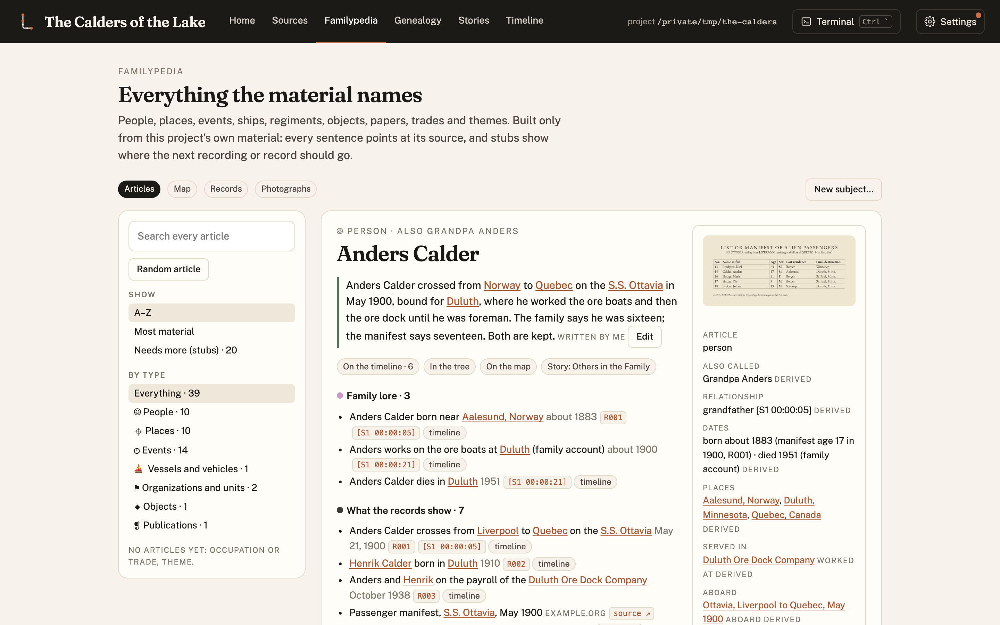

A person's article. The lead is written from the material. The infobox comes from the
records. Below it, what was witnessed, what was told, what is family lore, and what the
records show, each line with its citation. Here the family says Anders crossed at sixteen and
the manifest says seventeen, and the article keeps both.

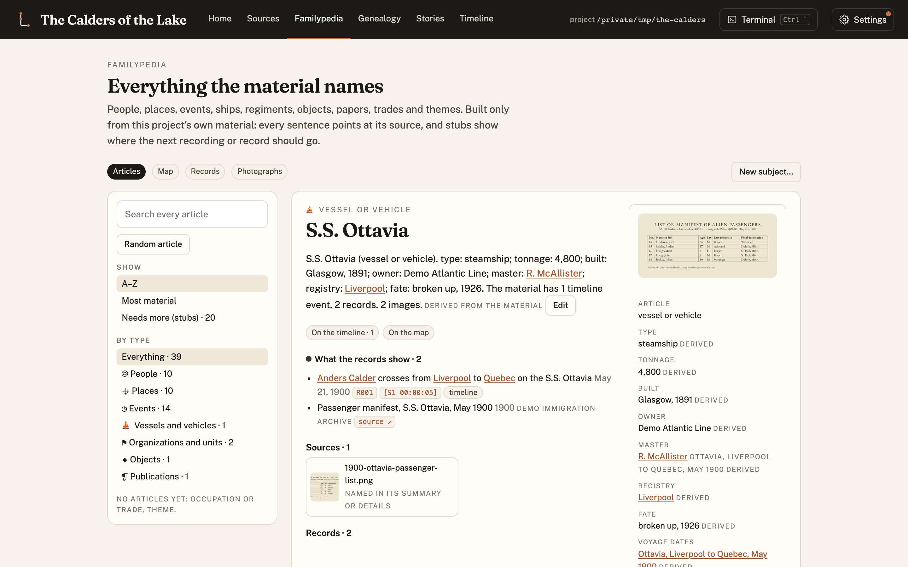

A ship gets the same treatment: type, tonnage, builder, owner, master, registry and fate from
the records; its voyages, its ports (each an article of its own) and the people aboard; the
records that document it and the sources that mention it. People, places, events,
organizations and units, objects, publications, occupations and themes all work this way.

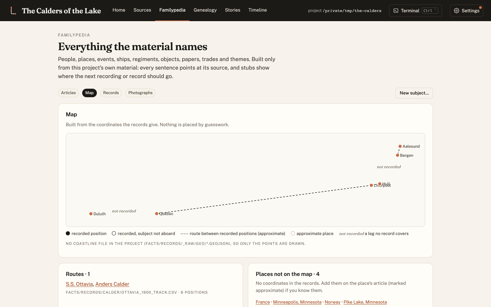

The map is drawn from the coordinates the records give, with the same evidence coding as a
book's maps: recorded positions solid, the track between them dashed, and any leg no record
covers labelled *not recorded* rather than drawn.

### Genealogy: built from evidence

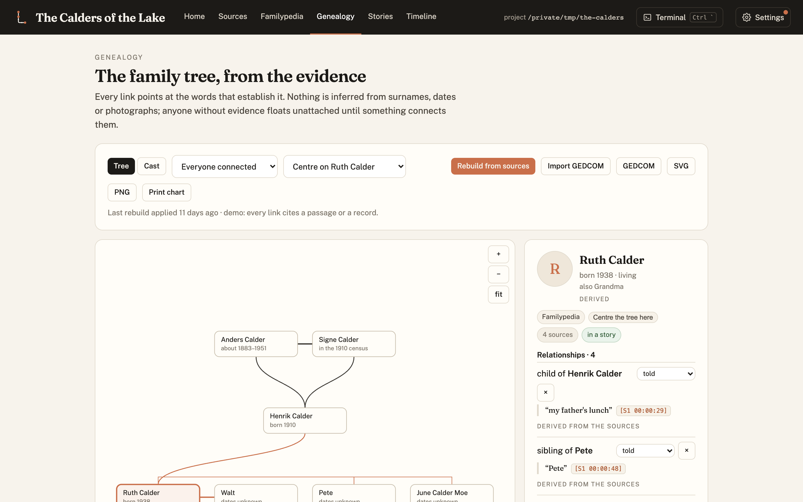

The tree is rebuilt from the sources, and every link points at the words or the record that
establish it. A link without evidence isn't drawn; a person nobody can place stays
unattached and is listed. Walt's surname is never said on the tape, so the tree doesn't give
him one. It exports to GEDCOM and imports from it.

### Timeline: what happened, and how sure we are

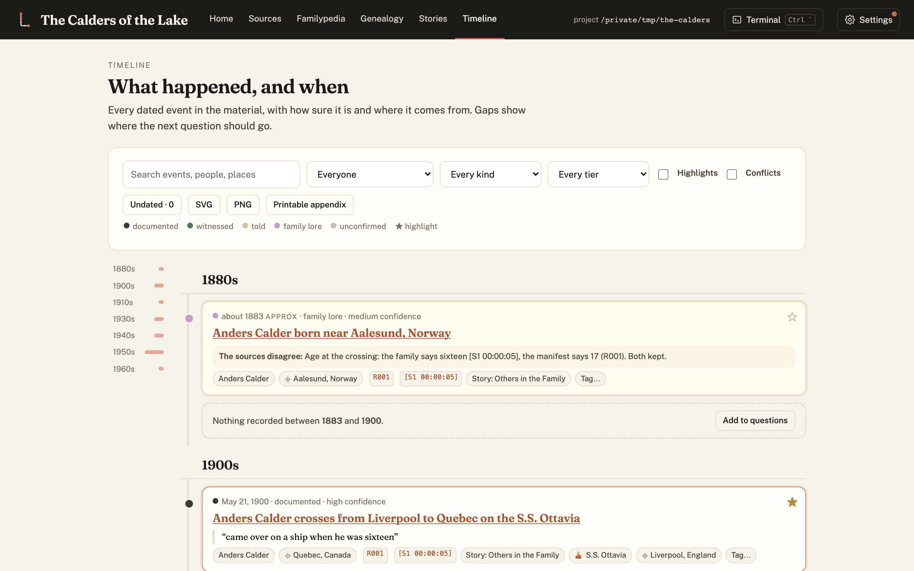

Every dated event, oldest first, coloured by tier, with its citations, the people and places
it touches, and a flag wherever the sources disagree. The gaps are part of the picture: each
one can become a question for the next recording.

### Stories: an export of the record

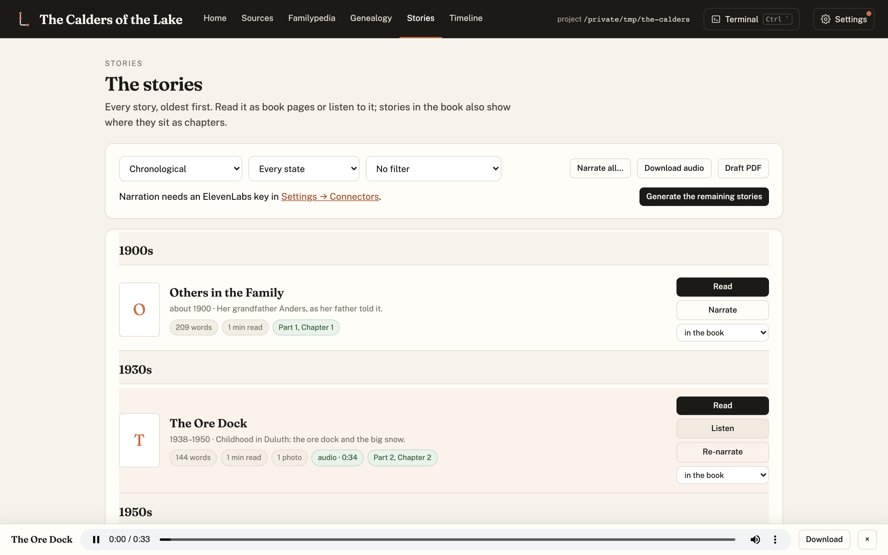

Stories are written from the record under strict rules (third person, quotes exact, every
paragraph cited) and can be narrated. The player follows you around the dashboard.

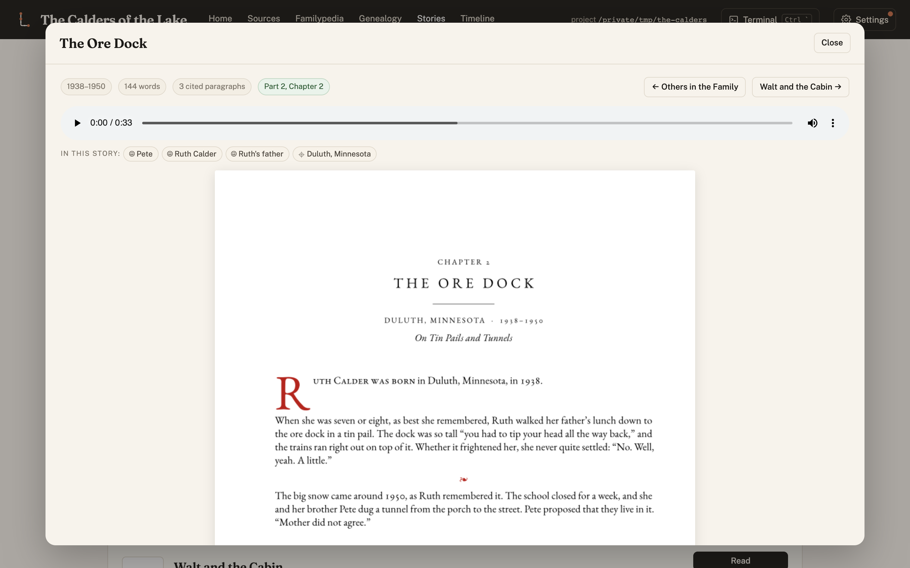

Read a story as the book's own pages, with what it rests on above them: every paragraph and
its citation chips (click one to hear that moment of the recording, or open the record), and
the people and places in it, each linked to their Familypedia article. A sentence the writer
wanted to add that the material didn't give it is a *bridge*: highlighted in the draft, and
the final build refuses to compile while one is unapproved.

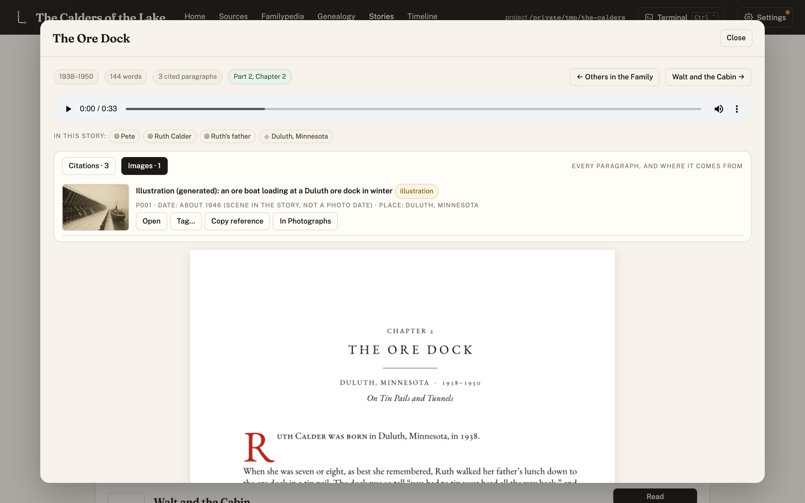

Each image in a story carries its provenance (its date and the basis for it, who is in it and
how we know, who holds it) and a toolbar to open it, tag it or find it among the
photographs. An illustration says so, everywhere.

### Contributors and connectors

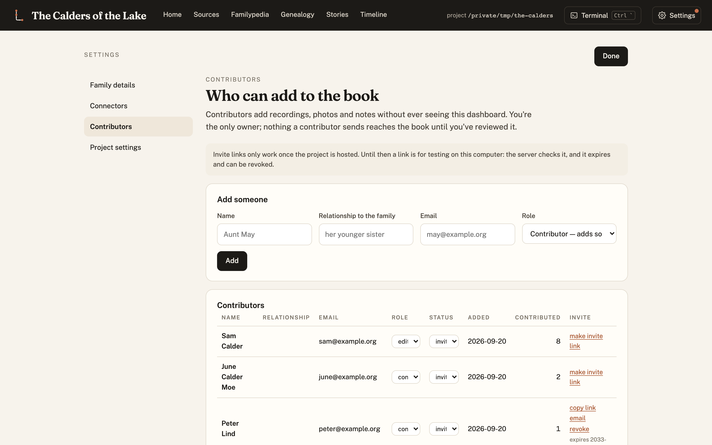

The people who add to the record: their role (contributor, reader, editor), what they've
added, and invitations. Requests to relatives ("could you scan the other ten letters?") are
drafted from what the record already flags as open.

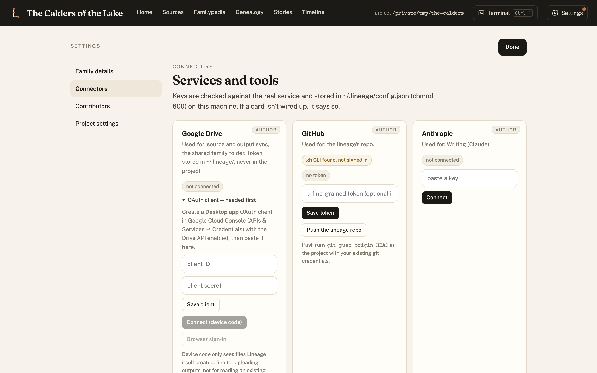

Keys stay on your machine (`~/.lineage`, readable only by you), never in the record. Google
Drive, GitHub, Anthropic, OpenAI, ElevenLabs, and the agent CLI the built-in terminal runs.

---

## Try it in 60 seconds

No recordings, no models and no accounts needed.

```bash
git clone https://github.com/rexsaurus/Lineage.git
cd Lineage
make install         # Python tools; needs typst (brew install typst)
make demo            # the dashboard, on a scratch copy of the demo lineage
```

`make demo` opens the dashboard on the Calders at http://127.0.0.1:8777. Everything in the
tour above is clickable. `make sample` builds the sample book PDF from the same invented
family (see below).

To start your own lineage:

```bash
make new PROJECT="$HOME/lineages/our-family"   # its own folder and its own (private) repo
cd "$HOME/lineages/our-family" && make dashboard
```

---

## The book, and the narration

When the record is ready, a book falls out of it. Story units are cut from the transcripts,
arranged on a chapter map, written under the style rules, set in Typst with front matter, a
timeline, a records appendix and an index, and checked for print (KDP, IngramSpark, Lulu,
Blurb). The same stories can be narrated for listening.

```
record ─► story units ─► chapter map ─► stories ─► book (PDF) and narration
           content/        data/        chapters/   output/
                         ▲                         ▲
                     approve the map          final sign-off
```

**Story units are the trick.** The transcript is cut into one file per story, each carrying
its source excerpt and its written version, and chapters are generated from units. Moving a
story is a one-line change and a rebuild, and a coverage check proves no part of the
recordings got quietly dropped. **Bridges are the other trick**: anything added that the
material didn't give is held for a person's approval, and the final build stops until it is.

### One chapter, start to finish

This chapter came from about twenty minutes of a father talking about an ancestor he'd only
heard stories about, plus a research pass that found the man's own letters in a museum
forty minutes from where he was born. It is annotated rule by rule in
[docs/EXAMPLE-CHAPTER.md](docs/EXAMPLE-CHAPTER.md).

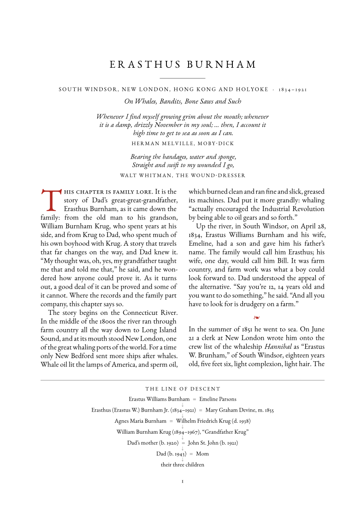 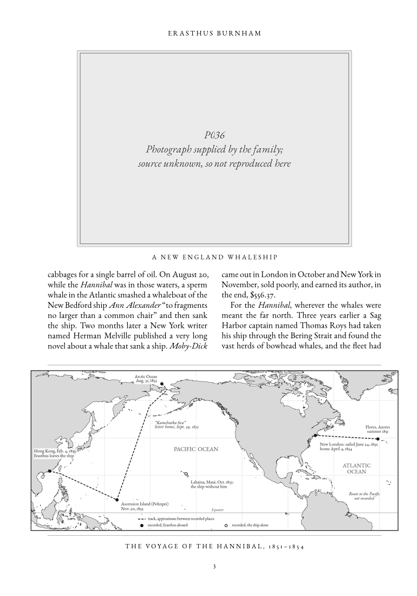 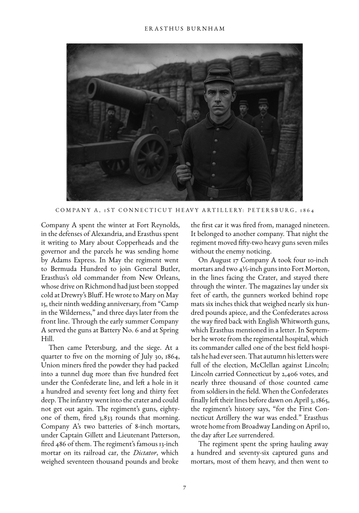

- **The opening says what kind of story it is**: *"This chapter is family lore,"* with the
  chain of tellers named.
- **The map shows what the records show**: recorded positions, the track between them, and
  a leg labelled *not recorded* rather than invented.
- **Where the records win, the book prints both versions** and explains the gap. The family
  remembered a surgeon; the regimental rolls say private, Company A.

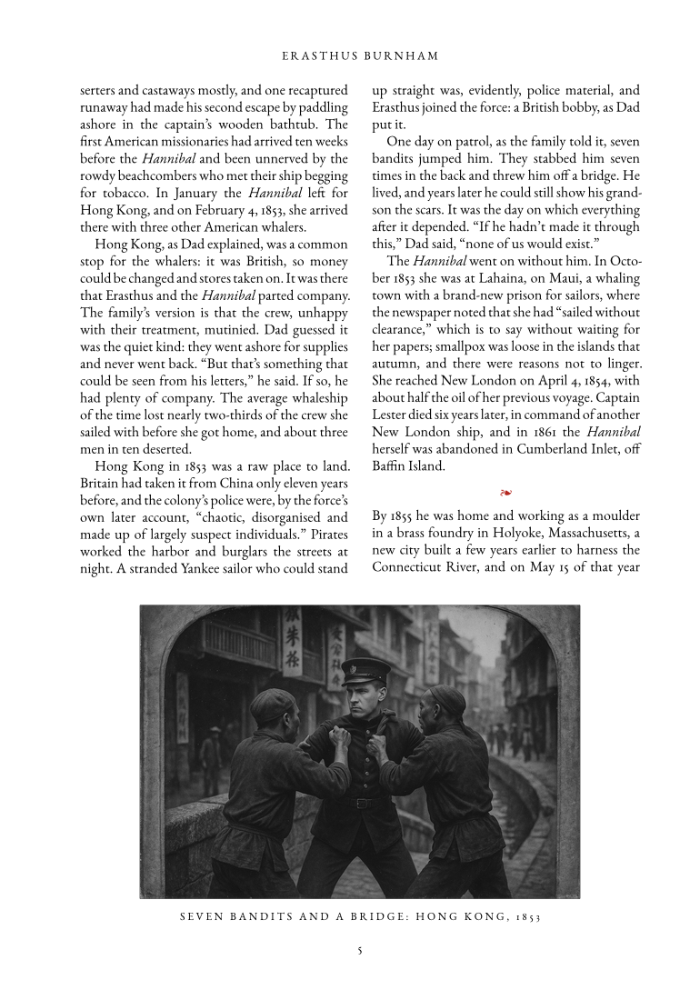 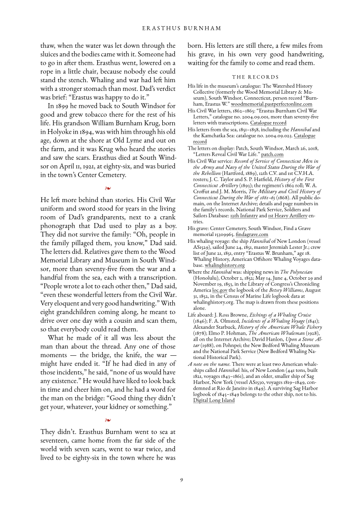 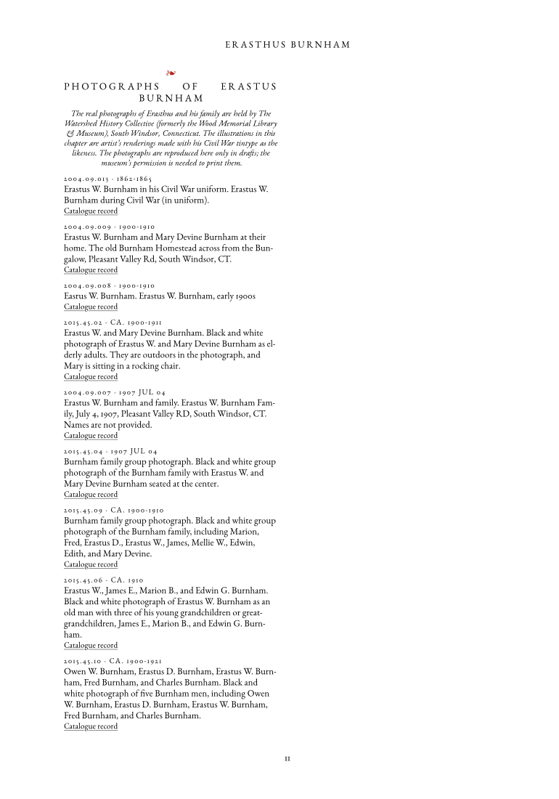

- **Family lore is kept as lore**, in the teller's own words, with what *is* documented
  around it.
- **THE RECORDS** lists every documented claim's source: catalogue numbers, crew lists,
  regimental histories, newspapers.
- **The photographs page** says plainly which pictures are real and which are illustrations.

`make sample` builds `examples/sample-project/output/book-draft.pdf` (a 30-page book about the
invented grandmother) and this chapter as `examples/erasthus-burnham/erasthus-burnham.pdf`.

---

## Your lineage uses Lineage; it doesn't contain it

A lineage (made with `make new`) keeps only its own material: recordings, transcripts,
sources, records, people, stories, photos. Everything else (skills, style, templates,
scripts, the dashboard) stays here and reaches the lineage as a release. The lineage pins the
release it runs in `lineage.lock`:

```bash
make lineage-version          # what this lineage runs
make update-lineage           # what a newer release would change, and which of your files it touches
make update-lineage APPLY=1   # install and pin it; stories it would alter are marked stale, never rewritten
make dashboard                # the dashboard, on this lineage
```

Improvements found while working on one family's record come back here and reach every
lineage as a release. Things only one family would want stay in its `local-overrides/`.

## The Factory

Lineage is one instance of a general pattern, and the repo ships the generator too: point it
at a different kind of source material and it writes a new pipeline with the same
guarantees (immutable sources, citations on every claim, evidence tiers, quarantined
inventions, human gates, versioning). See [docs/FACTORY.md](docs/FACTORY.md).

```
/plugin marketplace add rexsaurus/Lineage
/plugin install lineage@lineage     # the family record platform
/plugin install factory@lineage     # the generator
```

## What you need for a real lineage

- Whatever the family has: recordings in any common audio or video format, scans,
  photographs, letters, documents.
- A Mac or Linux machine with ffmpeg, Typst and Python. Transcription runs locally on CPU,
  faster on an NVIDIA GPU (`make install-transcribe`).
- A free Hugging Face token, only to download the speaker-labelling model, which then runs on
  your machine.
- A Claude subscription for Claude Code, which does the research and the writing.

## Honest limits

- The machine can't check a fact that isn't in a recording or a document you give it.
- Your files stay on your computer, but **text goes to a cloud model** while Claude reads and
  writes. See [PRIVACY.md](PRIVACY.md).
- Contributors are invited and their additions listed today; the hosted view where a cousin
  adds a letter from their own phone is still to come (see [app/ROADMAP.md](app/ROADMAP.md)).
- Research needs a person who cares. The tools find the records; deciding what they mean is
  yours.
- Keep your own lineage's repo private.

## Read next

- **[docs/HOWTO.md](docs/HOWTO.md)**: set up a lineage, invite contributors, add sources,
  research records, build the genealogy and Familypedia, then stories and a book.
- **[app/README.md](app/README.md)**: the dashboard, and exactly what it reads and writes.
- **[docs/EXAMPLE-CHAPTER.md](docs/EXAMPLE-CHAPTER.md)**: the chapter above, annotated.
- **[docs/FACTORY.md](docs/FACTORY.md)**: the pattern, and how to aim it at something else.
- **[CHANGELOG.md](CHANGELOG.md)**: releases.
- **[docs/DEPLOY.md](docs/DEPLOY.md)**: the public website (`make site`): landing page, docs and a read-only demo.

## License

Code, templates, skills and docs are MIT. The license does not cover your recordings,
transcripts, photographs or anything you make from them; those belong to you and your family.
The example chapter in `examples/erasthus-burnham/` is published for reading and learning
only. EB Garamond is under the SIL Open Font License. The demo lineage is invented, and its
scene pictures are generated illustrations.

*Built for my dad. The letters are still in that museum, in his great-great-grandfather's
very good handwriting, waiting for the family to come and read them.*
